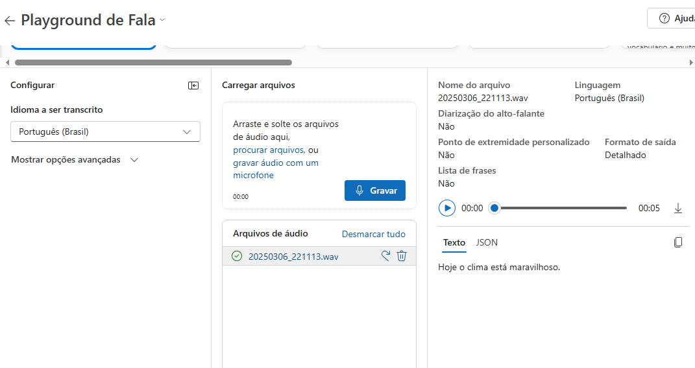
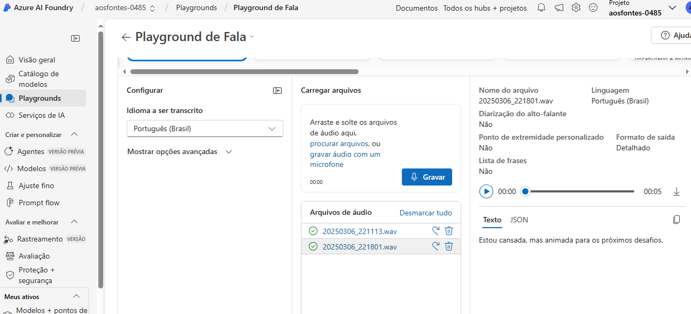
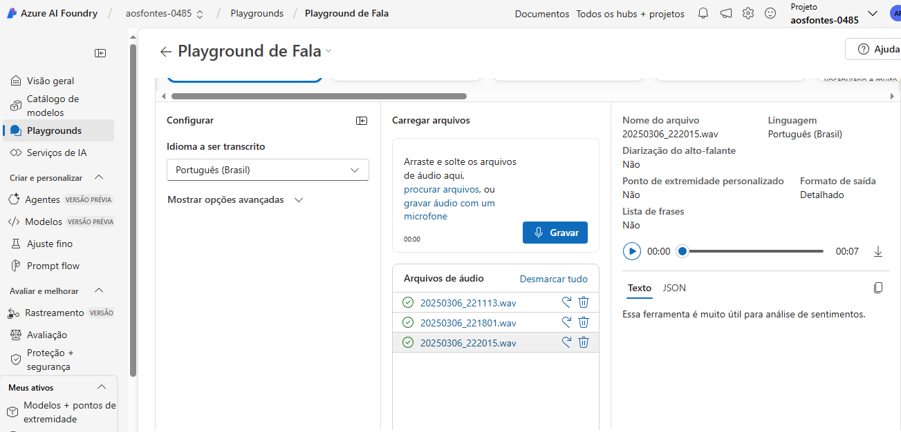
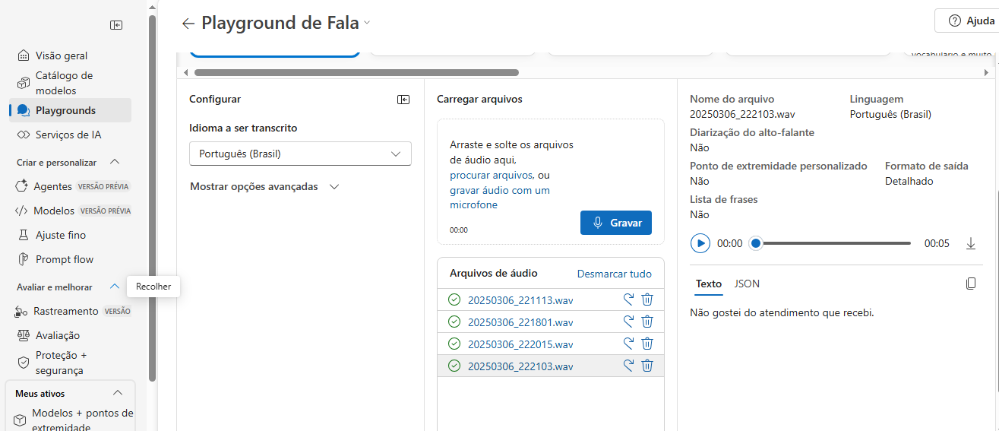

# Projeto - Análise de Sentimentos com IA

Este projeto foi desenvolvido como parte do desafio da DIO sobre análise de texto com ferramentas de IA.

## 🔍 Objetivo

Aplicar os conhecimentos de processamento de linguagem natural (NLP) utilizando o Azure Language Studio para analisar sentenças.

## 📂 Estrutura

- `inputs/sentencas.txt`: contém as frases utilizadas para análise.
- `prints/`: prints dos resultados obtidos com a IA.

## 🧠 Insights obtidos

- A IA consegue identificar com precisão sentimentos positivos, negativos e neutros.
- A ferramenta pode ser útil para empresas que querem entender o feedback de clientes de forma automatizada.
- Também é possível extrair entidades importantes de textos e fazer classificação de tópicos.

## 📸 Resultados

## 🚀 Possibilidades futuras

- Integrar com APIs para análise em tempo real.
- Fazer classificação de feedbacks em categorias específicas.
- Usar para monitoramento de redes sociais.

